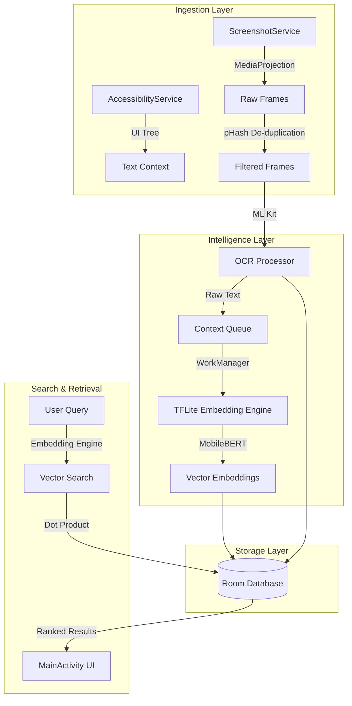

# OmniView: On-Device Semantic Memory

[](https://developer.android.com/)
[](https://kotlinlang.org/)
[](LICENSE)
[](#-privacy-first-philosophy)

**OmniView** is a privacy-first, on-device digital memory system for Android. It captures your screen activity, processes it by extracting text and converting it to vector embeddings, and allows you to semantically search through your past interactions—all without a single byte of data leaving your device.

---

##  Problem Statement

In the modern digital age, we consume massive amounts of information across dozens of apps every day. However, our ability to recall specific details—a recipe from an Instagram reel, a product from a random tweet, or a snippet of code from a tutorial—is limited by our memory and the lack of cross-app searchability.

Standard search tools only look through files or browser history. **OmniView** bridges this gap by creating a searchable, semantic index of everything you've ever seen on your screen.

##  Our Approach

OmniView operates as a "Background Intelligence" layer. It silently observes (with permission), understands the context of your screen using Computer Vision, and translates visual information into a mathematical "Vector Space" that can be queried naturally.

### Key Innovations:
- **Intelligent Incremental Capture**: Uses perceptual hashing to detect screen changes, ensuring we only process new information and save battery.
- **On-Device Inference**: Leverages **MobileBERT embeddings** and Google ML Kit OCR entirely on the Android Neural Networks API.
- **Power-Aware Processing**: Schedules heavy computational tasks like creating vector embeddings only when the device is charging and idle.

---

## System Architecture

OmniView is built on a modular four-layer architecture designed for performance and privacy.



### Layer Breakdown:
1. **Ingestion**: A foreground service captures screen data. We use a **Hamming distance** check on pHash values to skip identical frames.
2. **Intelligence**: 
   - **OCR**: Converts images to structured text.
   - Embeddings: Uses a specialized **MobileBERT** TFLite model to generate high-dimensional semantic vectors.
3. **Storage**: Data is persisted in a local **Room/SQLite** database with large embedding vectors being stored in a dedicated table optimized for fast scanning.
4. **Retrieval**: When you search (e.g., "that blue jacket I saw yesterday"), the app embeds your query and performs a similarity search across your history.

---

## Tech Stack

- **Language**: Kotlin 1.9+
- **UI Framework**: Jetpack Compose (Material 3)
- **Database**: Room Persistence Library
- **ML Inference**: 
  - **TensorFlow Lite (Play Services)** for **MobileBERT** Embeddings.
  - **Google ML Kit** for Latin Text Recognition.
- **Background Jobs**: WorkManager.
- **Capture**: MediaProjection API & Accessibility Service.

---

## Privacy-First Philosophy

Unlike cloud-based "Recalls," OmniView is built with a zero-trust architecture regarding external servers:
- **No Cloud Sync**: There is no backend server. Your data stays on your silicon.
- **App Blacklisting**: Sensitive apps (Banking, Password Managers) are automatically excluded from capture.
- **User Control**: One-tap pause/stop and easy "Clear History" options.

---

## Getting Started

### Prerequisites
- Android 11+ (API 30) for best MediaProjection performance.
- A device with at least 4GB of RAM (due to TFLite model size).

### Installation
1. Clone the repository:
   ```bash
   git clone https://github.com/divyansh-1009/OmniView.git
   ```
2. Open in **Android Studio Jellyfish+**.
3. Sync Gradle and ensure TFLite model files are downloaded into `app/src/main/assets/embeddingmodels/`.
4. Build and deploy to your physical device.

---

## 👥 The Team

This project was envisioned and built by:

*   **Divyansh Yadav** 
*   **Akhil Dhyani** 
*   **Harshil Agrawal** 
*   **Harshit Dhangar** 

---

## License

OmniView is released under the **MIT License**. See [LICENSE](LICENSE) for details.

---

