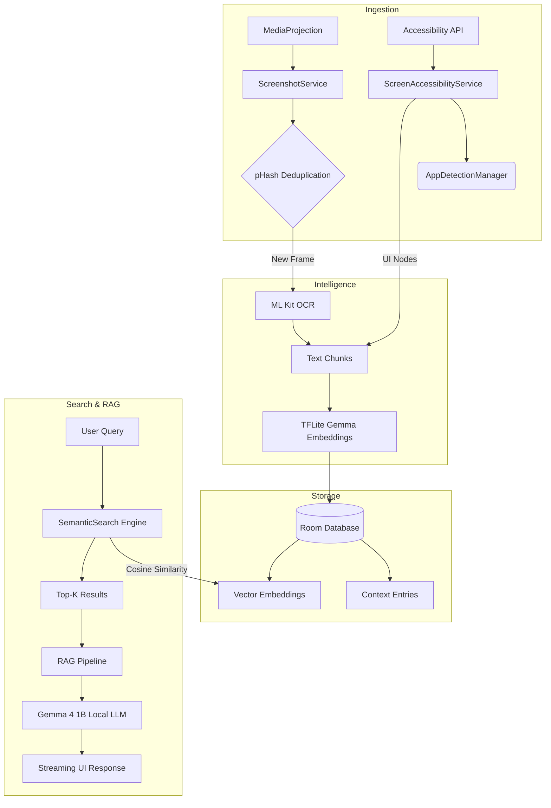

# OmniView

## Problem Statement
In today's digital age, we consume and interact with an overwhelming amount of information across various applications on our mobile devices. However, retrieving specific details—like a fleeting conversation, a passing product recommendation, or a crucial piece of text seen in an app—is incredibly difficult. Traditional screenshot tools only capture static images without searchable context, and cloud-based AI solutions pose severe privacy risks by uploading sensitive personal screen data to external servers.

## Our Solution
OmniView is an advanced, fully on-device Android screen intelligence system that acts as a continuous, semantic memory of your digital life. It solves the retrieval problem by capturing, embedding, and semantically storing your screen history locally. This enables you to interact and chat with your past context using local large language models — all completely offline and privacy-first, ensuring your sensitive data never leaves your device.

---

## Architecture Diagram



---

## Key Features

### Intelligent Screen Ingestion
- **Continuous Capture:** Uses a foreground MediaProjection service to capture screen states efficiently.
- **Real-time Accessibility Extraction:** Leverages Android's Accessibility Services to extract UI text natively as you navigate, bypassing the need for heavy OCR when text is available.
- **pHash Deduplication:** Computes perceptual hashes of screenshots to silently drop visually identical frames, saving battery and storage space.
- **App Detection & Blacklist:** Automatically detects the foreground app (via Accessibility and UsageStats fallback) to enforce a user-defined blacklist, preventing capture of sensitive apps (e.g., banking, password managers).

### On-Device Intelligence Pipeline
- **ML Kit OCR:** For images and non-native text, OmniView runs Google's ML Kit Text Recognition to extract context.
- **Local Embeddings (TFLite Gemma):** Every extracted text block is tokenised (custom pure-Kotlin WordPiece tokenizer) and embedded into high-dimensional vectors using an on-device TFLite Gemma model.
- **Battery-Aware Scheduling:** Heavy ML tasks (OCR and Embedding) are deferred to Android WorkManager queues and gated on charging state (battery >= 80%) to ensure zero impact on your daily battery life.

### RAG Pipeline & Semantic Search
- **Cosine Similarity Retrieval:** Employs L2-normalised dot products to find the top-K most semantically relevant memories to your query.
- **Local LLM (Gemma 4 1B):** Incorporates llama.cpp JNI bindings to stream responses from a quantised 800MB Gemma model hosted inside a robust foreground service to prevent OS kills during generation.
- **Strict Hallucination Prevention:** A carefully engineered system prompt forces the model to only use the retrieved context, preventing it from hallucinating or defaulting to its training data.

### Privacy-First Storage
- **Room Database:** All context, OCR data, and embeddings are stored securely in an on-device SQLite database via Room.
- **Zero Cloud:** There is no telemetry, no tracking, and no external API calls. Your data never leaves your device.
- **One-Tap Wipe:** A dedicated Settings feature allows you to instantly wipe the entire database and clear all processing queues.

---

## Software Architecture

The application is heavily modularised into five core packages:

1. **ingestion**: Contains the ScreenshotService, ScreenAccessibilityService, and AppDetectionManager. Responsible for gathering raw pixels and UI nodes.
2. **intelligence**: Houses OcrProcessor, EmbeddingEngine, and the WorkManager classes that crunch raw data into semantic vectors.
3. **storage**: The Room database DAOs, Entities, and AppStateManager for managing preferences and blacklists.
4. **search**: The SemanticSearch engine that performs vector distance calculations.
5. **rag**: Contains RAGPipeline, LlamaEngine, and LlamaService which handle context injection and LLM token streaming.
6. **ui**: Jetpack Compose layer featuring a dark, Material 3 aesthetic, the conversational AskScreen, and comprehensive settings drawers.

---

## Requirements & Setup

### Device Requirements
- Android 7.0 (API 24) or higher (Android 14+ recommended for full MediaProjection stability)
- Minimum 4GB RAM (due to the 800MB local LLM model)
- Required Permissions: FOREGROUND_SERVICE, POST_NOTIFICATIONS, PACKAGE_USAGE_STATS, and Accessibility

### Running the App
1. Clone the repository and open the project in Android Studio.
2. Build and install the APK onto a physical device (emulators may struggle with local LLM inference).
3. Open the app and grant the required permissions via the Settings Drawer (Usage Access, Accessibility, Notifications).
4. Tap Start Screenshot Service to begin building your memory.
5. Provide the LLM model (e.g., gemma-3-1b-it-q4_k_m.gguf) in the app's internal files directory via ADB:
   ```bash
   adb push model.gguf /data/data/com.omniview.app.ui/files/
   ```
